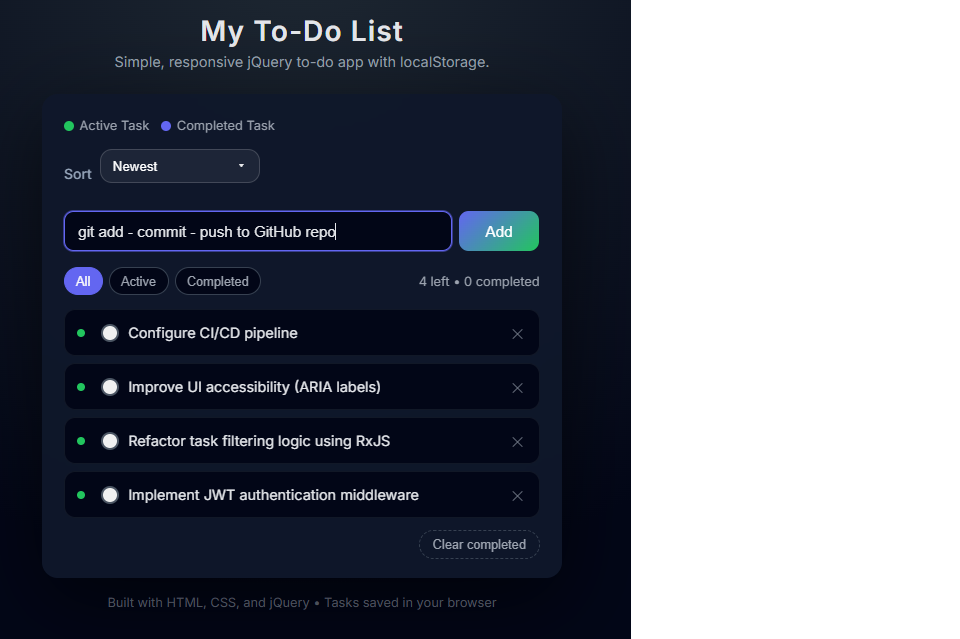
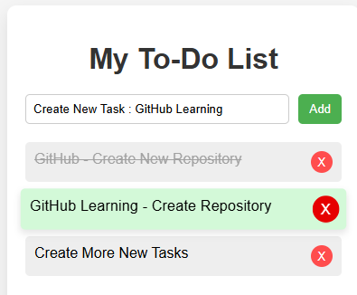
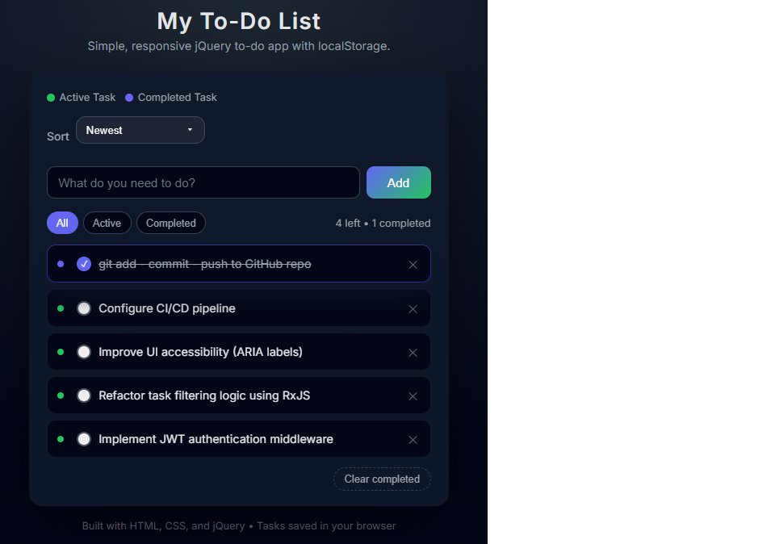

# jQuery To-Do List App

A modern, interactive To-Do List web app built with **HTML, CSS, jQuery**, and **localStorage**.  
Fully functional with **Add, Delete, Mark Complete**, and **tasks persist after page refresh**.  

---

## 🌐 Live Demo

[View Live App](https://heng03a.github.io/jQuery-todo-app/)

---

## 📸 Screenshots

**Add Task & Hover Effects**  


**Delete Task & Slide/Fade Animation**  


**Task Completed**  


> You can create a `screenshots` folder in your repo and upload these images.

---

## ⚡ Features

- Add new tasks  
- Mark tasks as complete  
- Delete tasks with smooth slide/fade animation  
- Tasks persist after page refresh using `localStorage`  
- Modern UI with hover effects and responsive design  
-----
## 📸 Features Overview (Screenshots)

### ➕ Add New Task


### ❌ Delete Task


### ✔️ Mark Task as Complete


---

## 🛠️ How to Run

1. Clone the repository:

```bash
git clone https://github.com/heng03a/<your-repo-name>.git
