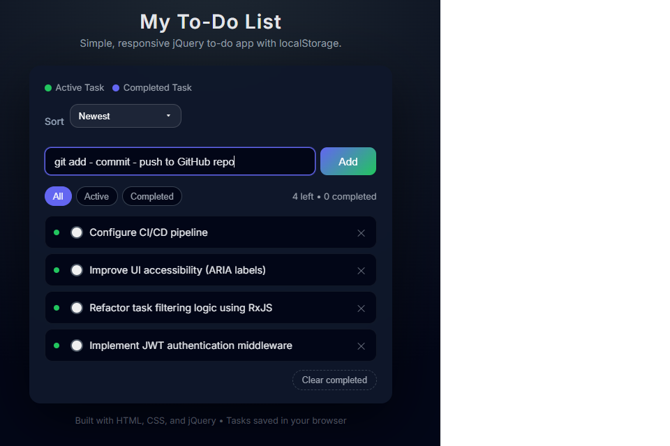
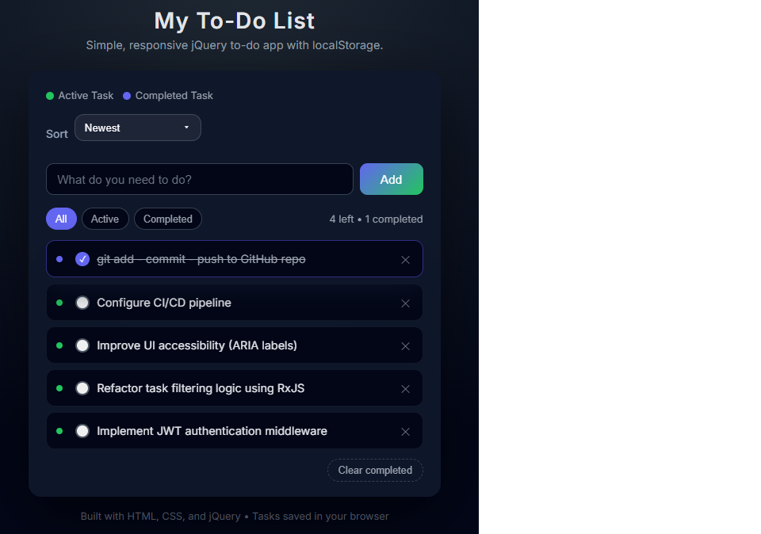
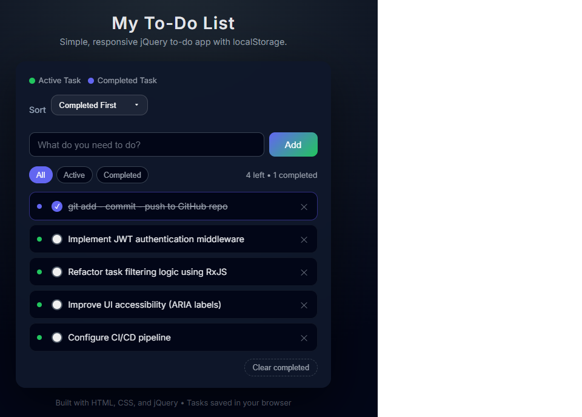
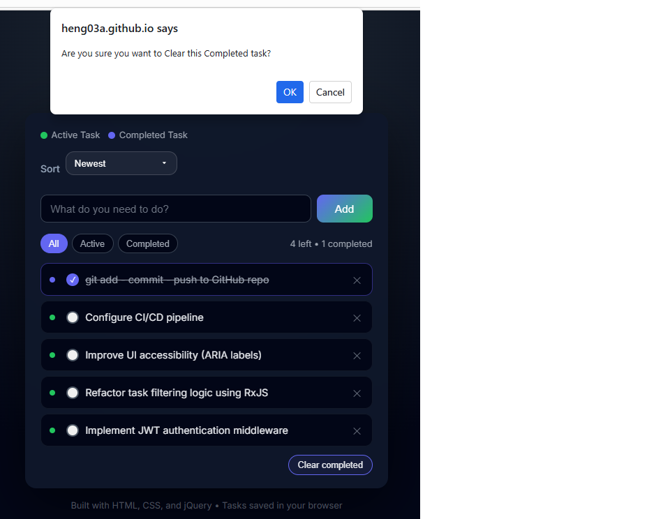
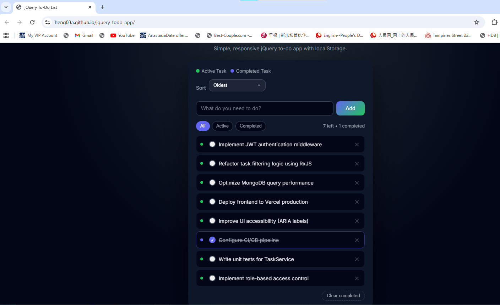
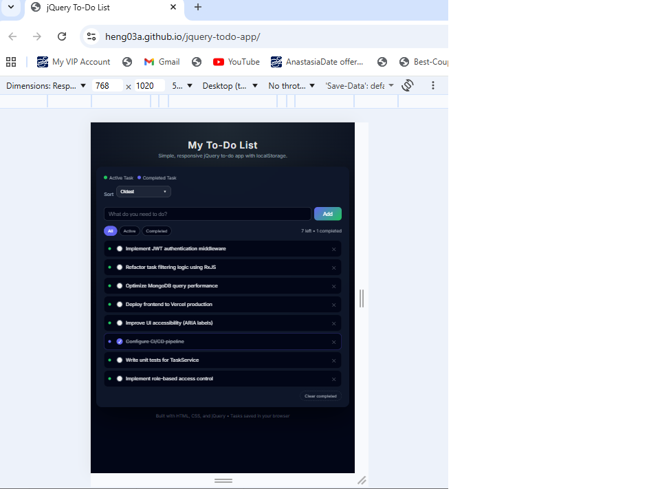
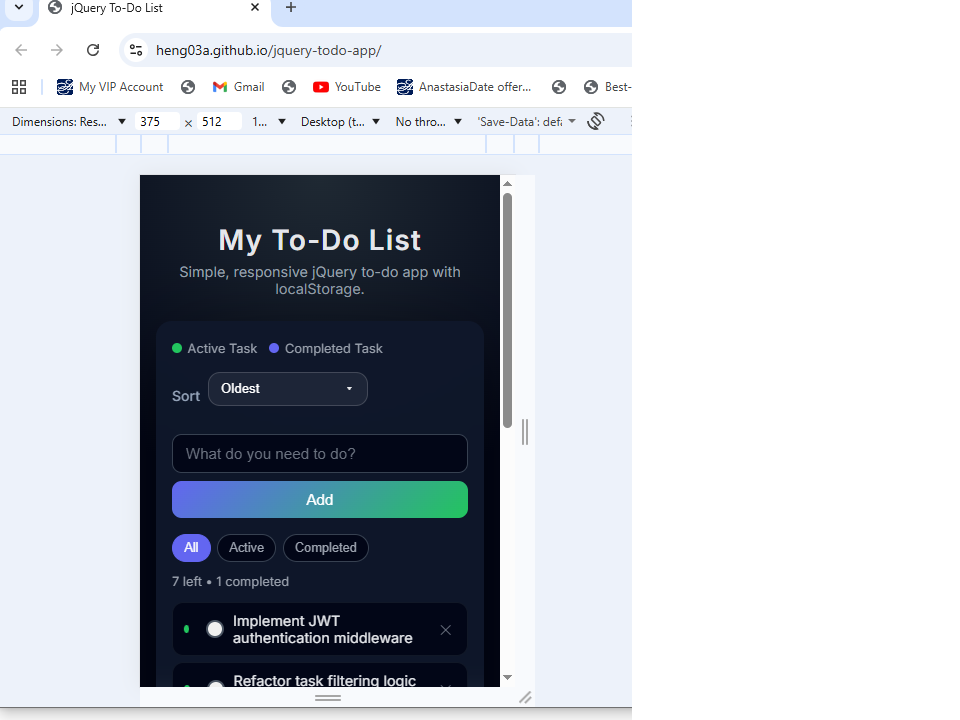
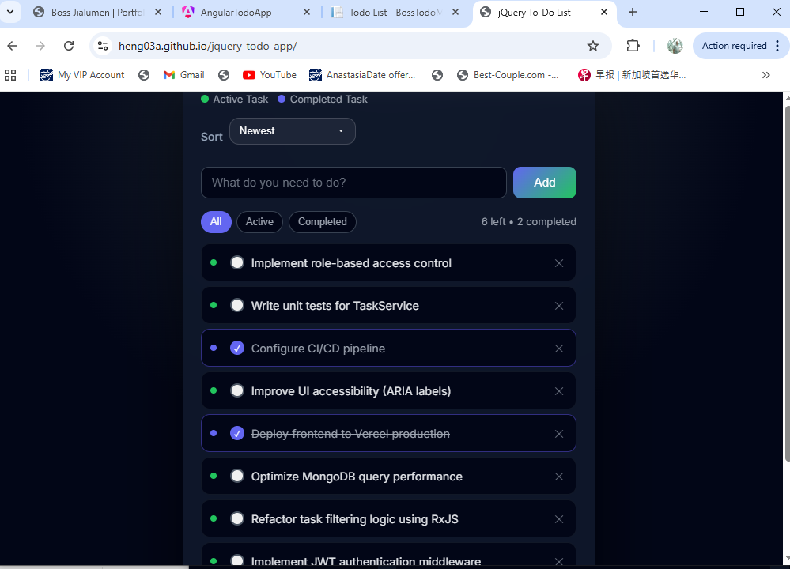
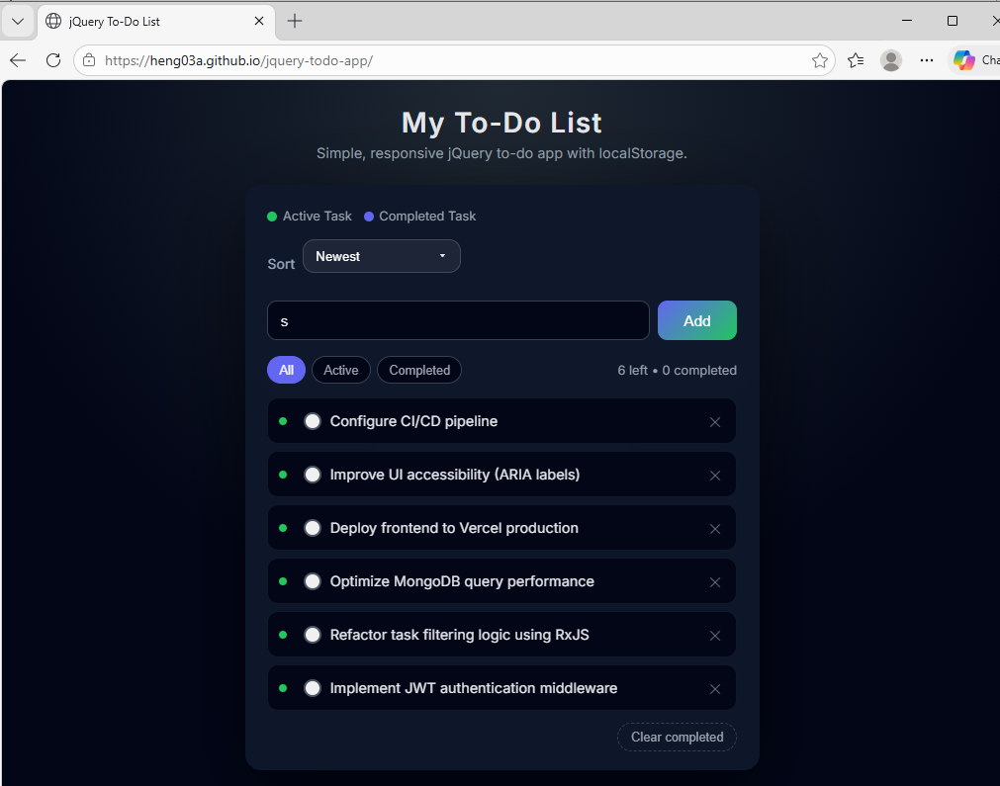
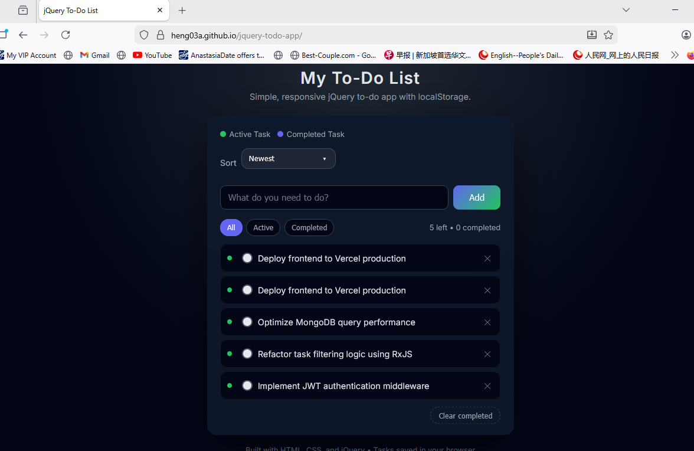

# jQuery To-Do List App - built with **HTML, CSS, jQuery**, and **localStorage**

## 🔍 Project Overview

- A modern, interactive To-Do List web app built with **HTML, CSS, jQuery**, and **localStorage**.  
- Fully functional with **Add, Delete, Mark Complete**, and **tasks persist after page refresh**.  
- Implements mobile-first responsive design with flexible layout containers, breakpoint-aware CSS,
  and viewport testing across 320px–1440px."

### This application provides a complete Todo management system featuring:
* Task creation, editing, deletion
* Completion / undo functionality
* Sorting & filtering logic
* Responsive UI (mobile → desktop)
* GitHub Cloud deployment with 24/7 availability

---
## 🌐 Live Demo

* 🔗 **Frontend :** https://heng03a.github.io/jquery-todo-app/

## 📂 GitHub Repository
* 🔗 **GitHub Repository :** https://github.com/Heng03a/jquery-todo-app/blob/main/README.md

## 🛠 Tech Stack
- HTML5
- CSS3
- JavaScript
- jQuery
---

## Architecture Overview

```
User Browser
      │
      ▼
HTML / CSS Interface
      │
      ▼
jQuery Application Logic
      │
      ▼
Local Storage Persistence
```

## Architectural Principles
## Design Characteristics

* Lightweight front-end application
* Client-side data persistence
* Responsive layout design
* Cross-browser UI behaviour validation

## 🧩 Maintainability Considerations

## 📈 Scalability Design

## 📸 Screenshots - ✨ Key Functional Features

**Add Task**  


**Task Completed**  



**Sort Completed Task First**  


**Clear completed task**  


---

### Responsive Design Strategy

- This application uses a **mobile-first responsive CSS architecture**.

* Base styles are designed for small screens without relying on media queries.
* Layouts use flexible units (`rem`, `%`) and modern layout systems (`flexbox`) to adapt naturally across screen sizes.
* Media queries are applied using `min-width` breakpoints to progressively enhance the interface for larger viewports.

## Key design decisions include:

* A global reset using `box-sizing: border-box` to ensure consistent layout calculations.
* A responsive page wrapper with fluid width and controlled maximum width for desktop readability.
* Vertical stacking for form controls on mobile, enhanced to horizontal layouts on larger screens.
* Touch-friendly spacing and scalable typography to support usability on all devices.

- This approach ensures the application works **anytime, anywhere, on any device**, - without duplicating layout logic or relying on device-specific assumptions.

---
## 📱 Responsive & Cross-Browser Validation
* Mobile-first  UI design layout

## 📱 Responsive Design Proof
- Tested on Chrome, Edge, Firefox
- Flexbox-based layout
- Overcome Responsive container constraints

### Desktop View


### Tablet View


### Mobile View


## 📱 Responsive Design Implementation
- This application was built using a mobile-first design philosophy.
- Core Responsive Characteristics
* Flexible layout containers
* Centered content wrapper
* Adaptive button stacking on smaller screens
* Touch-friendly controls
* Consistent spacing & alignment
* No layout shift across breakpoints

## Breakpoint Strategy
* Mobile: 360px+
* Tablet: 768px+
* Desktop: 1024px+
The layout maintains structural integrity across device sizes.

## ✨ Key Functional Features
* Add new tasks
* Mark tasks complete / undo
* Clear completed Task
* Sort by: 
* Newest
* Oldest
* Completed First
* Active First
* Tasks persist after page refresh using `localStorage`  
* Modern UI with hover effects and responsive design  

### UX Enhancements
* Status indicator legend
* Stable button alignment
* Clear visual hierarchy
* Clean typography and spacing

## 🌐 Cross-Browser Compatibility

-Tested on:

- Google Chrome (latest)
- Microsoft Edge (latest)
- Firefox (latest)

-All layout and interactive functionality are working consistently across modern browsers.

## 📱 Cross-browser Reliability Proof

| Google Chrome | Microsoft Edge | Firefox |
|---------------|----------------|---------|
|  |  |  |


## 🚀 Challenges & Solutions


## Deployment Details - ☁️ GitHub Deployment & CI/CD
Deployment Flow
* Local development
* git add, git commit, git push
* Live Production URL updated at GitHub
- No manual server management required.
* Production Characteristics
* Always available (24/7)

### ▶️ Access GitHub URL
* Access:
* https://heng03a.github.io/jquery-todo-app/

## 🔐 Production Considerations

## 📈 Improvements / Future Enhancements


## Application Built and maintained by :-

Jialumen (Phua Kia Heng)

Full Stack Web Developer
Singapore

GitHub: https://github.com/Heng03a

